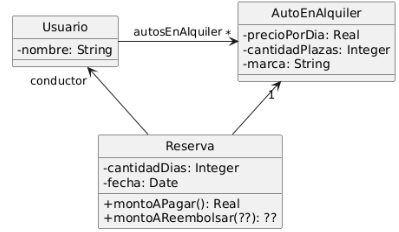

# Ejercicio 12: Alquiler de Automóviles
En un sistema de alquiler de automóviles se quiere introducir funcionalidad para calcular el monto que será reembolsado (devuelto) si se cancela una reserva.  Dicho reembolso podrá variar con respecto al monto total pagado, de acuerdo a la política de cancelación que sea determinada para el vehículo.

Se parte del siguiente diseño al que se necesita agregar la funcionalidad antes mencionada. El monto a pagar por una reserva se calcula como el precio por día del auto del cual se hizo la reserva,  multiplicado por la cantidad de días.

Cada automóvil debe tener una política de cancelación que puede ser una de tres: flexible, moderada o estricta. Dichas políticas pueden cambiar con el tiempo en cualquier momento.

Se quiere calcular el monto a reembolsar de una reserva si se hiciera una cancelación. Dada  una fecha tentativa de cancelación, se debe devolver el monto que sería reembolsado. El cálculo se hace de la siguiente manera. 

 a) Si el automóvil tiene política de cancelación flexible, se reembolsará el monto total sin importar la fecha de cancelación (que de todas maneras debe ser anterior a la fecha de inicio de la reserva).

 b) Si el automóvil tiene política de cancelación moderada, se reembolsará el monto total si la cancelación se hace hasta una semana antes y 50% si se hace hasta 2 días antes.

 c) Si el automóvil tiene política de cancelación estricta, no se reembolsará nada (0, cero) sin importar la fecha tentativa de cancelación.
 
## Tareas
1. Modifique el diagrama de clases UML para considerar los cambios necesarios. Indique el patrón de diseño utilizado y las ventajas de su uso en este diseño en particular. Documente los roles que cada clase cumple en el patrón
2. Implemente en Java
3. Muestre en un snippet de código Java cómo crear un automóvil con una política de cancelación flexible y luego imprima en pantalla el valor de reembolso. Luego, cambie la política a cancelación moderada y vuelva a imprimir en pantalla el valor de reembolso. 