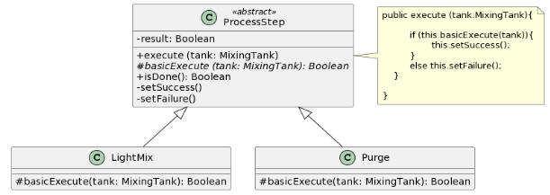
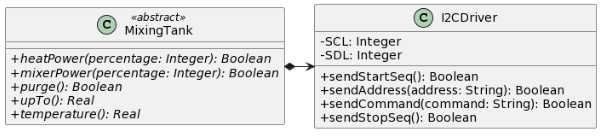

# Ejercicio 13: Monitoreo de línea de producción
Una empresa necesita desarrollar un sistema para monitorear su línea de producción, en la cual se usa un tanque mezclador/calentador. El tanque posee un motor que mueve paletas internas y un calentador eléctrico; con esto se puede controlar el mezclado y la temperatura del líquido contenido dentro del tanque. Además se puede controlar el vaciado (la “purga”) del tanque mediante una válvula.

Para modelar la línea de producción en este sistema se definió al proceso productivo como una secuencia de pasos y estos pasos se representaron mediante una jerarquía de clases. A continuación se detalla el esquema para dos de estos pasos:

En el diagrama de clases puede verse:
- La clase base ProcessStep define la estructura común para todos los pasos: 
- - El método execute(tank: MixingTank) recibe como parámetro un tanque mezclador (MixingTank) y ejecuta sobre el tanque los comandos de la etapa correspondiente.  Para esto invoca al método basicExecute(tank) que cada etapa implementa el cual retorna si la ejecución fue o no exitosa;
  - El método isDone() retorna un booleano que describe si la etapa fue realizada con éxito.
- Las clases LightMix y Purge son especializaciones de ProcessStep y representan pasos concretos del proceso.

Se detalla a continuación el pseudocódigo del funcionamiento de estas etapas.

| clase LightMix | clase Purge | 
|---|---|
| basicExecute(tank:MixingTank){ return tank.heatPower(20%) && tank.mixerPower(5%) } | basicExecute(tank:MixingTank){ return tank.heatPower(0%) && tank.mixerPower(0%) && tank.purge() } |

El fabricante del tanque provee una librería que permite controlar el tanque desde una computadora. Se tiene para ello la siguiente clase abstracta que ofrece una interfaz de alto nivel con las operaciones básicas del tanque y permite la comunicación entre el tanque y la computadora a través del protocolo I2C

No se dispone de una implementación concreta de MixingTank pero su comportamiento esperado es el siguiente:
- heatPower: configura el nivel potencia de la fuente de calor del tanque de 0 a 100
- mixerPower: configura el nivel de potencia de la mezcladora del tanque de 0 a 100
- purge: comanda al tanque para que se desagote
- upTo: retorna el volumen ocupado del tanque de 0 a 100
- temperature: retorna la temperatura del contenido del tanque
## Tareas
1. Implemente las clases ProcessStep, LightMix y Purge, completando el pseudocódigo provisto.
2. Implemente Test de Unidad para ambas clases cubriendo casos de éxito y falla: Explique qué tipo de TestDouble es necesario implementar para cubrir esta versión de test cases.

# Ejercicio 13b: Monitoreo de línea de producción (ext)
Se han definido nuevas especificaciones para el tanque (MixingTank) y se han redefinido los comportamientos de LightMix y Purge. 
## MixingTank:
Tiempo en completar el método purge: 4 segundos
Transferencia de calor según el nivel de potencia recibido en heatPower (es decir, la velocidad con la que sube la temperatura del tanque mezclador depende de la potencia que se le quiere aplicar):
- 100% = + 5 ºC por segundo
- 75% = + 4 ºC por segundo
- 50% = + 2 ºC por segundo
- 25% = + 1 ºC por segundo
- 0% = + 0 ºC por segundo

| clase LightMix | clase Purge | 
|---|---|
| basicExecute(tank:MixingTank){ &nbsp;&nbsp;temp = tank.temperature()  &nbsp;&nbsp;tank.heatPower(100%) &nbsp;&nbsp;delay(2sec) &nbsp;&nbsp;if(tank.temperature()-temp == 10 ){ &nbsp;&nbsp;&nbsp;&nbsp;tank.mixerPower(5%) &nbsp;&nbsp;&nbsp;&nbsp;return true &nbsp;&nbsp;} &nbsp;&nbsp;else { &nbsp;&nbsp;&nbsp;&nbsp;return false &nbsp;&nbsp;} } | basicExecute(tank:MixingTank){ &nbsp;&nbsp;if (tank.upTo() == 0) { &nbsp;&nbsp;&nbsp;&nbsp;return false &nbsp;&nbsp;} &nbsp;&nbsp;else { &nbsp;&nbsp;&nbsp;&nbsp;tank.heatPower(0%) &nbsp;&nbsp;&nbsp;&nbsp;tank.mixerPower(0%) &nbsp;&nbsp;&nbsp;&nbsp;tank.purge() &nbsp;&nbsp;&nbsp;&nbsp;delay(4sec) &nbsp;&nbsp;&nbsp;&nbsp;if (tank.upTo() != 0){ &nbsp;&nbsp;&nbsp;&nbsp;&nbsp;&nbsp;return false &nbsp;&nbsp;&nbsp;&nbsp;} &nbsp;&nbsp;&nbsp;&nbsp;return true &nbsp;&nbsp;} } |

## Tareas
1. Actualice la implementación de las clases LightMix y Purge y de los test cases cubriendo casos de éxito y falla. 
2. Explique qué tipo de TestDouble es necesario implementar para cubrir esta versión de test cases.

Ayuda: Para implementar el delay en Java, debe utilizar Thread.sleep(long millis)
