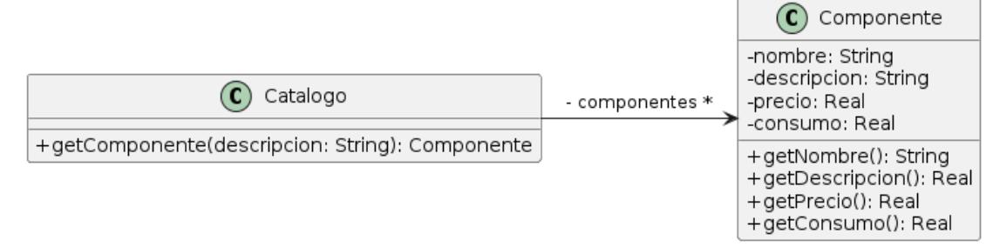

## Ejercicio 14: Armado de PCs

Una empresa de venta de computadoras ofrece una variedad de configuraciones para satisfacer las necesidades de sus clientes. En la actualidad, la empresa ofrece tres configuraciones: básica, intermedia y gamer.

Cuando se solicita un presupuesto para un equipo, se registra también el nombre de la persona que hizo la solicitud y la fecha en que se realizó. Cabe destacar que cada presupuesto debe ser para un solo equipo.

Las configuraciones ofrecidas en este momento se muestran en la siguiente tabla:

|                    | Básico                                                 | Intermedio                                    | Gamer                                                                                                                                                                                                                                                                                                          |  |
|--------------------|--------------------------------------------------------|-----------------------------------------------|----------------------------------------------------------------------------------------------------------------------------------------------------------------------------------------------------------------------------------------------------------------------------------------------------------------|--|
| Procesador         | Procesador Básico                                   | Procesador Intermedio                      | Procesador Gamer. Hay que agregar un pad térmico y un cooler                                                                                                                                                                                                                     |  |
| Memoria ram     | 8 GB                                                | 16 GB                                      | 32 gb + 32 gb                                                                                                                                                                                                                                                                                      |  |
| Disco              | HDD 500 GB                                       | SSD 500 GB                              | SSD 500gb + SSD 1 TB                                                                                                                                                                                                                                                                            |  |
| Tarjeta gráfica | No posee (integrada)                             | GTX 1650                                   | RTX 4090.                                                                                                                                                                                                                                                                                                   |  |
| Gabinete           | Gabinete Estándar (ya viene con fuente) | Gabinete Intermedio. Fuente 800 w | Gabinete Gamer Para saber que fuente requiere, se debe sumar el consumo de sus componentes + 50% de ese consumo. Luego ese resultado debe ser incluido en la descripción de la forma "fuente consumo w". |  |

Para simplificar la atención a sus clientes, no ofrece componentes sueltos, sólo equipos definidos por sus técnicos. En el futuro, la empresa está interesada en ampliar constantemente su oferta mediante la incorporación de nuevas configuraciones de equipos. Para resolverlo, se cuenta con una clase **Catálogo ya implementada** que ofrece un método *#getComponente(String)* que retorna un componente que coincide con la descripción dada (ej, *getComponentes(*"gabinete gamer"), o getComponentes("fuente 858 w") ). Siempre retornará uno que coincida con la descripción dada.

Ud debe implementar la siguiente funcionalidad:

- **Crear presupuestos** para las configuraciones mostradas. Tenga en cuenta que su solución debe facilitar el lanzamiento de nuevas configuraciones.
- **Calcular el consumo de un equipo:** El consumo de un equipo está formado por la suma de los consumos de cada uno de sus componentes.
- **Calcular el precio de un equipo:** El precio final de un equipo está formado por la suma de los precios de cada uno de sus componentes más el 21% de IVA.

### Tareas:

- 1. Modele una solución usando un diagrama UML para el problema planteado utilizando alguno de los patrones vistos en la materia. Indique cuáles y los roles en su diseño.
- 2. Implemente en Java la funcionalidad requerida.
- 3. Liste los pasos necesarios, de forma breve, los cambios que deben realizarse en su solución si se tiene la necesidad de agregar nuevas configuraciones. Especifique si se deben agregar subclases, métodos en clases existentes, renombrar métodos, etc.
- 4. La empresa tiene la intención de incorporar otras configuraciones que agregan monitores y periféricos. ¿Qué cambios debería realizar en su solución? Liste los pasos necesarios para hacerlo (especifique si se deben agregar subclases, métodos en clases existentes, renombrar métodos, etc).
