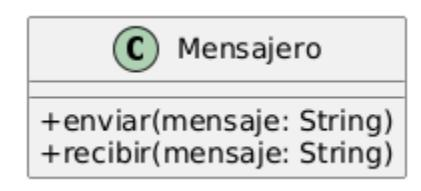
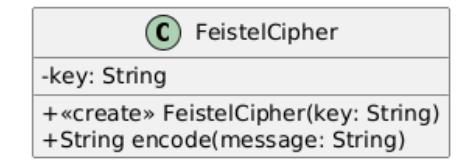
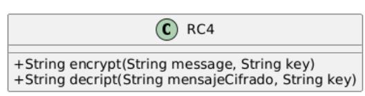

## Ejercicio 15: Mensajero

En un sistema de mensajería instantánea (similar a WhatsApp), los mensajes se transmiten entre dispositivos a través de la red. Para evitar que los mensajes puedan ser interceptados y leídos por terceros, se busca incorporar un mecanismo de cifrado: el mensaje se cifra antes de ser enviado y se descifra al recibirlo.

Actualmente, el diseño del sistema cuenta con una clase **Mensajero** que permite enviar y recibir mensajes de texto, como se muestra en el siguiente diagrama UML:

Se desea extender este diseño para que el mensajero pueda utilizar diferentes algoritmos de cifrado, de forma intercambiable.

En este ejercicio se trabajará con dos algoritmos concretos: **FeistelCipher** y **RC4**, aunque el diseño debe contemplar la posibilidad de incorporar nuevos algoritmos en el futuro.

Cada algoritmo maneja las claves de cifrado de manera distinta:

- **FeistelCipher**: Requiere una clave en el momento de la creación del objeto. Luego utiliza esa clave internamente para cifrar y descifrar mensajes. Este algoritmo utiliza encode para cifrar y el mismo mensaje para descifrar
- **RC4**: Necesita que la clave se proporcione cada vez que se realiza una operación de cifrado o descifrado.

**Nota**: Para realizar este ejercicio, utilice el material adicional que se encuentra en el siguiente [LINK](https://drive.google.com/file/d/1fiS6tQHHIw1XIwz675GH0q5GU1N4WGb2/view?usp=sharing). Allí encontrará un proyecto Maven que contiene el código fuente de las clases *FeistelCipher y RC4*. **Estas clases no deben ser modificadas**

### **Tareas**:

- 1. Diseñe una solución que permita al mensajero utilizar cualquiera de los algoritmos de cifrado de manera intercambiable. Sí la solución utiliza patrones de diseño indique cuales, y marque con estereotipos en el diagrama UML los roles de los participantes.
- 2. Al momento de enviar un mensaje, ¿con cuantos algoritmos de cifrado puede trabajar el mensajero al mismo tiempo?
- 3. Escriba un **ejemplo del código Java** necesario para instanciar un mensajero que envía un mensaje con cifrado **FeistelCipher** al que luego se le cambia la forma de cifrar a **RC4** y envía el mismo mensaje. Implemente la solución en Java.

