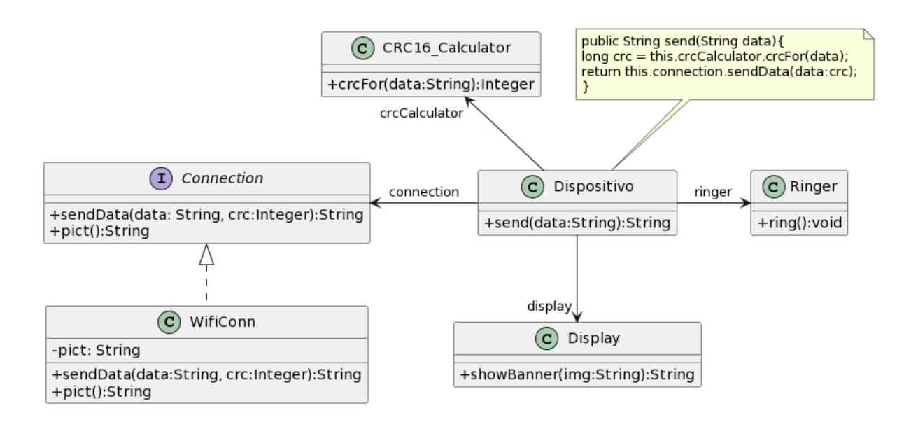
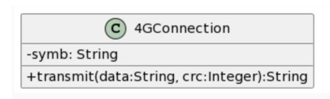
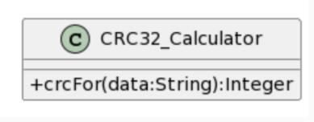

## Ejercicio 17: Dispositivo móvil y conexiones

Sea el software de un dispositivo móvil que utiliza una conexión WiFi para transmitir datos. La figura muestra parte de su diseño:



#### **Nuevas clases a utilizar:**






El dispositivo utiliza, para asegurar la integridad de los datos emitidos, el mecanismo de cálculo de redundancia cíclica que le provee la clase CRC16\_Calculator que recibe el mensaje crcFor(data: String) con los datos a enviar y devuelve un valor numérico. Luego el dispositivo envía a la conexión el mensaje sendData con ambos parámetros (los datos y el valor numérico calculado).

Se desea hacer dos cambios en el software. En primer lugar, se quiere que el dispositivo tenga capacidad de ser configurado para utilizar conexiones 4G. Para este cambio se debe utilizar la clase 4GConnection.

Además se desea poder configurar el dispositivo para que utilice en distintos momentos un cálculo de CRC de 16 o de 32 bits. Es decir que en algún momento el dispositivo seguirá utilizando CRC16\_Calculator y en otros podrá ser configurado para utilizar la clase CRC32\_Calculator. Se desea permitir que en el futuro se puedan utilizar otros algoritmos de CRC.

Cuando se cambia de conexión, el dispositivo muestra en pantalla el símbolo correspondiente (que se obtiene con el getter pict() para el caso de WiFiConn y symb() de 4GConnection) y se utiliza el objeto Ringer para emitir un ring().

Tanto las clases existentes como las nuevas a utilizar pueden ser ubicadas en las jerarquías que corresponda (modificar la clase de la que extienden o la interfaz que implementan) y se les pueden agregar mensajes, pero no se pueden modificar los mensajes que ya existen porque otras partes del sistema podrían dejar de funcionar.

Dado que esto es una simulación, y no dispone de hardware ni emulador para esto, la signatura de los mensajes se ha simplificado para que se retorne un String descriptivo de los eventos que suceden en el dispositivo y permitir de esta forma simplificar la escritura de los tests.

Modele los cambios necesarios para poder agregar al protocolo de la clase Dispositivo los mensajes para

- cambiar la conexión, ya sea la 4GConnection o la WifiConn. En este método se espera que se pase a utilizar la conexión recibida, muestre en el display su símbolo y genere el sonido.
- poder configurar el calculador de CRC, que puede ser el CRC16\_Calculator, el CRC32\_Calculator, o pueden ser nuevos a futuro.


- 1. Realice un diagrama UML de clases para su solución al problema planteado. Indique claramente el o los patrones de diseño que utiliza en el modelo y el rol que cada clase cumple en cada uno.
- 2. Implemente en Java todo lo necesario para asegurar el envío de datos por cualquiera de las conexiones y el cálculo adecuado del índice de redundancia cíclica.
- 3. Implemente test cases para los siguientes métodos de la clase Dispositivo:

```
a. send
b. conectarCon
c. configurarCRC
```

En cuanto a CRC16\_Calculator, puede utilizar la siguiente implementación:

```
public long crcFor(String datos) {
      int crc = 0xFFFF;
      for (int j = 0; j < datos.getBytes().length; j++) {
             crc = ((crc >>> 8) | (crc << 8)) & 0xffff;
             crc ^= (datos.getBytes()[j] & 0xff);
             crc ^= ((crc & 0xff) >> 4);
             crc ^= (crc << 12) & 0xffff;
             crc ^= ((crc & 0xFF) << 5) & 0xffff;
      }
      crc &= 0xffff;
      return crc;
}
```

Nota: para implementar CRC32\_Calculator utilice la clase java.util.zip.CRC32 de la siguiente manera:

```
CRC32 crc = new CRC32();
String datos = "un mensaje";
crc.update(datos.getBytes());
long result = crc.getValue();
```

