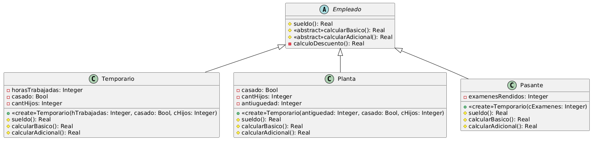

# Ejercicio 2: Cálculo de Sueldos
Sea una empresa que paga sueldos a sus empleados, los cuales están organizados en tres tipos: Temporarios, Pasantes y Planta. El sueldo se compone de 3 elementos: sueldo básico, adicionales y descuentos. 

table | Temporarios | Pasantes | Planta
--- | --- |----------| ---
Básico | $ 20.000 + cantidad de horas que  trabajó * $ 300. | $20.000  | $50.000
Adicional | $5.000 si está casado $2.000 por cada hijo | $2.000 por examen que rindió | $5.000 si está casado $2.000 por cada hijo $2.000 por cada año de antigüedad
Descuento | 13% del sueldo básico 5% del sueldo adicional | " | "

## Tareas
1. Diseñe la jerarquía de Empleados de forma tal que cualquier empleado puede responder al mensaje #sueldo. 
2. Desarrolle los test cases necesarios para probar todos los casos posibles.
3. Implemente en Java.

## UML 
