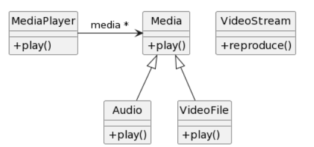
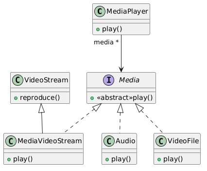

# Ejercicio 3: Media Player
Usted ha implementado una clase Media player, para reproducir archivos de audio y video en formatos que usted ha diseñado. Cada Media se puede reproducir con el mensaje play(). Para continuar con el desarrollo, usted desea incorporar la posibilidad de reproducir Video Stream. Para ello, dispone de la clase VideoStream que pertenece a una librería de terceros y usted no puede ni debe modificarla. El desafío que se le presenta es hacer que la clase MediaPlayer pueda interactuar con la clase VideoStream. 
La situación se resume en el siguiente diagrama UML:

## Tareas
1. Modifique el diagrama de clases UML para considerar los cambios necesarios. Si utiliza patrones de diseño indique los roles en las clases utilizando estereotipos.
2. Implemente en Java

## Solución
### UML

Para resolver este ejercicio, se utilizo el patron de diseño Adapter