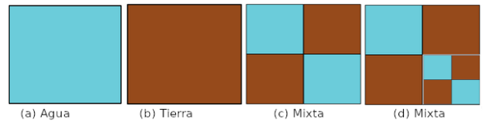

# Ejercicio 4: Topografías
Un uso común de imágenes satelitales es el estudio de las cuencas hídricas que incluye saber la proporción entre la parte seca y la parte bajo agua. En general las imágenes satelitales están divididas en celdas. Las celdas son imágenes digitales (con píxeles) de las cuales se quiere extraer su “topología”.
Un objeto Topografía representa la distribución de agua y tierra de una celda satelital, la cual está formada por porciones de “agua” y de “tierra”. La siguiente figura muestra:
(a) el aspecto de una topografía formada únicamente por agua.
(b) otra formada solamente por tierra.
(c) y (d) topografías mixtas.

Una topografía mixta está formada por partes de agua y partes de tierra (4 partes en total). Estas a su vez, podrían descomponerse en 4 más y así siguiendo.

La proporción de agua de una topografía sólo agua es 1. La proporción de agua de una topografía sólo tierra es 0. La proporción de agua de una topografía compuesta está dada por la suma de la proporción de agua de sus componentes dividida por 4. En el ejemplo, la proporción de agua es: (1+0+0+1) / 4 = 1/2. La proporción siempre es un valor entre 0 y 1.

## Tareas
1. Diseñe e implemente las clases necesarias para que sea posible:
    - crear Topografías, 
    - calcular su proporción de agua y tierra, 
    - comparar igualdad entre topografías. Dos topografías son iguales si tienen exactamente la misma composición. Es decir, son iguales las proporciones de agua y tierra, y además, para aquellas que son mixtas, la disposición de sus partes es igual.
      Pista: notar que la definición de igualdad para topografías mixtas corresponde exactamente a la misma que implementan las listas en Java. https://docs.oracle.com/javase/8/docs/api/java/util/AbstractList.html#equals-java.lang.Object-
2. Diseñe e implemente test cases para probar la funcionalidad implementada. Incluya en el set up de los tests, la topografía compuesta del ejemplo. 

# Ejercicio 4b: Más topografías
Extienda el ejercicio anterior para soportar (además de Agua y Tierra) el terreno Pantano. Un pantano tiene una proporción de agua de 0.7 y una proporción de tierra de 0.3. No olvide hacer las modificaciones necesarias para responder adecuadamente la comparación por igualdad.

## Resolución