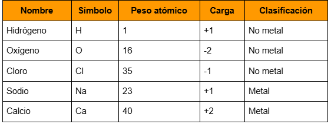
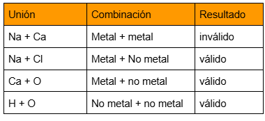

# Ejercicio 5: Sustancias químicas
Nota: Este ejercicio comenzó a trabajarse en la clase teórica, donde se planteó el problema y se discutieron algunos conceptos.
En química inorgánica, las sustancias pueden estar formadas por átomos individuales o por la unión de varias sustancias.
- Ejemplos de átomos individuales son H (hidrógeno), O (oxígeno), Na (sodio), Ca (calcio)
- Ejemplos de uniones de sustancias pueden ser H₂O (agua), NaCl (cloruro de sodio), CaO (óxido de calcio), Ca(OH)₂ (hidróxido de calcio).

Una unión puede estar formada directamente por átomos, o bien incluir otras uniones como componentes. Por ejemplo, OH (hidroxilo) es una unión que puede aparecer dentro de sustancias más grandes como NaOH o Ca(OH)₂.
De cada átomo se conoce: nombre, símbolo, peso atómico (entero simplificado), carga típica y clasificación (metal / no metal).
Ejemplos:

### Reglas de Cobinación 

Los elementos se pueden combinar según las siguientes reglas. No todas las combinaciones son válidas 
- Metal + No metal → válidas
- No metal + No metal → válidas
- Metal + Metal → no válidas

### Estabilidad: Moléculas e iones

Una unión es estable (se denomina molécula) cuando la suma de las cargas de todos sus componentes es igual a 0. La carga total de una sustancia es la suma de las cargas de sus componentes. Si la carga total no es cero, la unión se denomina ion.
Ejemplos:
- H₂O → (+1 +1 -2) = 0  -> molécula
- NaCl → (+1 -1) = 0  -> molécula
- CaO → (+2 -2) = 0  -> molécula
- NaOH → (+1 -1) = 0  -> molécula
- Ca(OH)₂ → (+2 + (-1 × 2)) = 0  -> molécula
- OH → (-1)  -> es un ion, no neutro

### Peso Molecular
El peso molecular de una sustancia es la suma de los pesos atómicos de todos sus componentes, considerando la cantidad de veces que aparece cada uno.
Ejemplos de peso molecular:
- H₂O → 1 + 1 + 16 = 18
- NaCl → 23 + 35 = 58
- CaO → 40 + 16 = 56
- Ca(OH)₂ → 40 + (16 + 1) × 2 = 74

## Tareas
1. Implemente las clases necesarias para que las instancias de ElementoQuimico responden a los siguientes mensajes:
1.1 fórmula() que retorna un String que:
- Para átomos retorna su símbolo
- Para uniones lo crea a partir de sus componentes (por ejemplo H20)

1.2 pesoMolecular() que retorna un Integer con el peso del elemento.

1.3 carga() que retorna un Integer con el valor de la carga

1.4 esValida()
- para átomos siempre es “verdad” 
- para uniones valida las reglas de combinación presentadas anteriormente.

1.5 La solución debe incluir un mecanismo para crear uniones químicas utilizando elementos ya creados.
2. Implemente los casos de test de unidad que permitan verificar  que su implementación funciona correctamente

