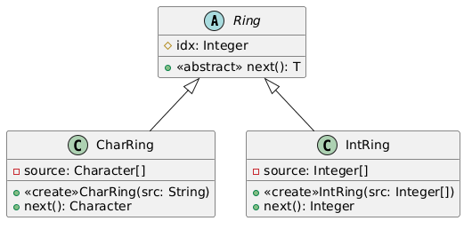

1) Diseñe e implemente Test de Unidad para las clases CharRing e IntRing. Asegúrese de que los test pasen.
2) Aplique el refactoring Extract Superclass. Detalle cada uno de los pasos intermedios que son necesarios para poder aplicar correctamente este refactoring.
3) Verifique que los tests definidos en el paso 1 sigan funcionando correctamente.
4) Realice un diagrama de clases UML con el diseño refactorizado.
