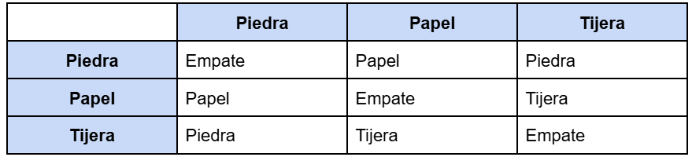
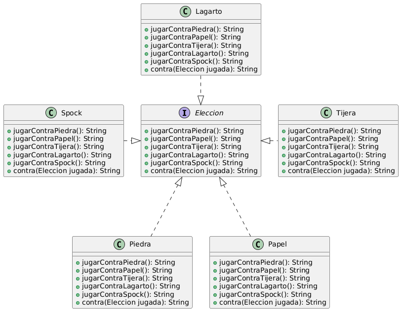

# Ejercicio 2: Piedra Papel o Tijera (o Lagarto, o Spock...)
## Inciso
Se quiere programar en objetos una versión del juego Piedra Papel o Tijera. En este juego dos jugadores eligen entre tres opciones: piedra, papel o tijera. La piedra aplasta la tijera, la tijera corta el papel, y el papel envuelve la piedra. Los jugadores eligen una opción y se determina un ganador según las reglas:

Tareas:
Diseñe e implemente una solución a este problema, de forma tal que dadas dos opciones, determine cuál fue la ganadora, o si hubo empate
Se desea extender al juego a una versión más equitativa que integre a lagarto y Spock, con las siguientes reglas:
Piedra aplasta tijera y aplasta lagarto.
Papel cubre piedra y desaprueba Spock.
Tijera corta papel y decapita lagarto.
Lagarto come papel y envenena Spock.
Spock rompe tijera y vaporiza piedra.
¿Qué cambios se necesitan agregar?
Agregue los cambios a la solución anterior.

## UML
